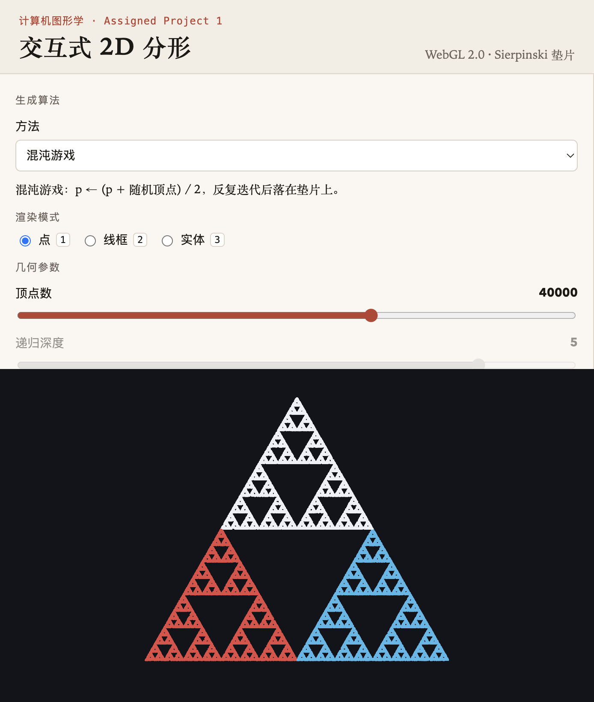
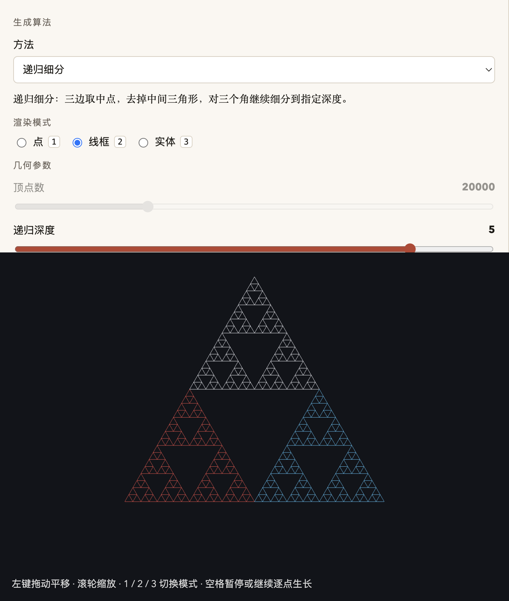
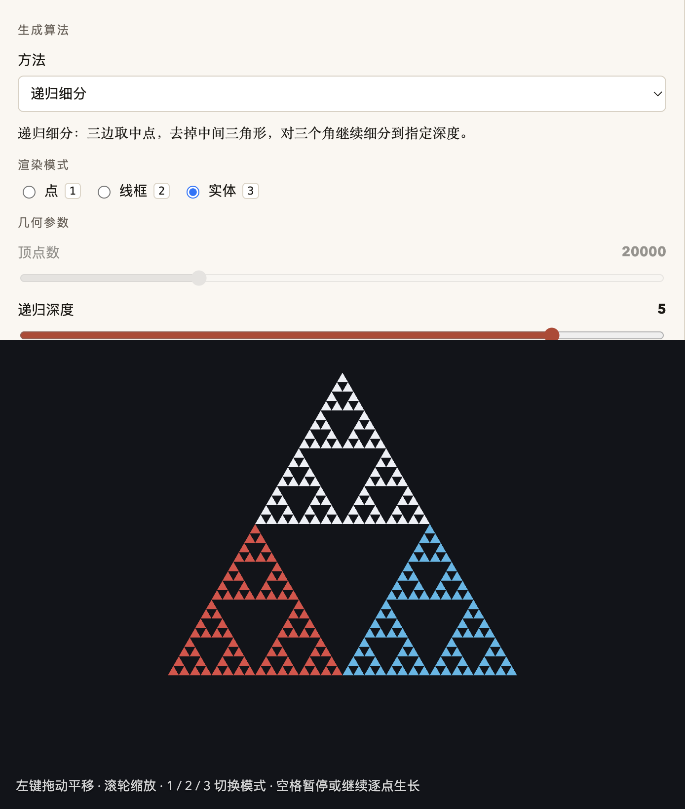
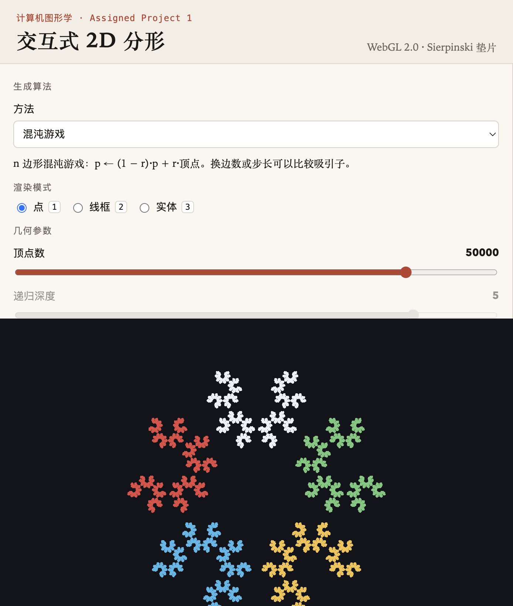
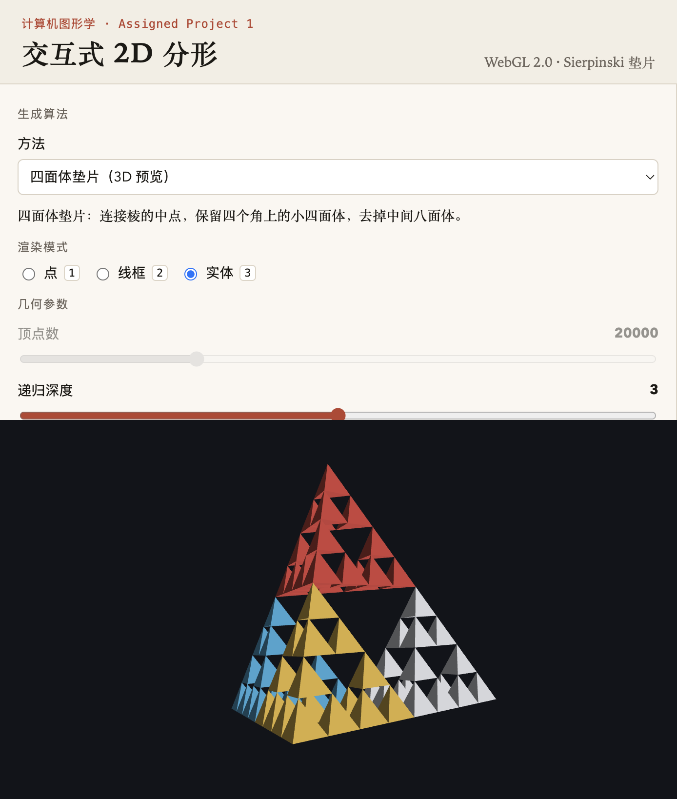

# AP1 · 交互式 2D 分形

用 WebGL 2.0 生成 Sierpinski 垫片。同一张图可以用混沌游戏或递归细分得到，并在点、线框、实体之间切换。

在线运行：<https://wasdwasding.github.io/computer-graphics/AP-1/>

## 运行

页面没有构建步骤。任意静态服务器即可：

```bash
cd AP-1
python3 -m http.server 8080
```

浏览器打开 <http://localhost:8080/>。不要直接双击 `index.html`，模块脚本在 `file://` 下可能被浏览器拦住。

## 两种生成算法

### 混沌游戏

在三角形内部取一点，反复执行

```text
p ← (p + 随机顶点) / 2
```

也就是每次朝三个顶点之一走一半。迭代足够多次后，点会落在 Sierpinski 垫片上。程序先空转 24 步，丢掉起点附近的过渡点，再记录至少 5000 个点，用 `gl.POINTS` 绘制。点的颜色是最后一次选中的顶点。

### 递归细分

`subdivide(triangle, depth)`：深度为 0 时保留这个三角形；否则取三边中点，连接后去掉中间那块，只对三个角上的小三角形继续递归。深度 `d` 得到 `3^d` 个三角形。同一组三角形可以画成：

| 按键 | 模式 | 图元 |
|---|---|---|
| `1` | 点 | `gl.POINTS` |
| `2` | 线框 | `gl.LINES` |
| `3` | 实体 | `gl.TRIANGLES` |

深度 0–6 都只在 CPU 上生成一次顶点数组，再经 `gl.bufferData` 送进 VBO，深度 6 也不会把递归栈撑爆。

## 交互

- **面板**：混沌游戏调顶点数；递归和四面体调深度。另外有点大小、三套配色（经典 / 暖色 / 霓虹）、渲染模式。
- **鼠标**：左键拖动平移，滚轮缩放，缩放中心是光标。监听的是 `mousedown`、`mousemove`、`wheel`。
- **键盘**：`1` / `2` / `3` 切换点、线框、实体。在混沌游戏里按 `2` 或 `3` 会切到递归细分，因为随机点没有边和面。
- **空格**：暂停或继续逐点生长。点数从 0 大约用 8 秒长到滑条上的目标值；长完后再按空格会从头播放。

## 截图

混沌游戏点云：



递归细分线框（深度 5）：



递归细分实体（深度 5）：



## 选做

**E1 n 边形混沌游戏。** 边数可以选 3–6。一般形式是 `p ← (1-r)·p + r·顶点`。三角形锁定 `r = 1/2`。五边形默认 `r ≈ 0.618`（黄金比例的倒数）且不重复上一顶点，得到另一套吸引子：



**E3 三维四面体垫片。** 每次连接六条棱的中点，保留四个角上的小四面体，去掉中间的八面体。观察矩阵用 `MV.js` 的 `perspective`、`lookAt`、`rotate` 和 `mult` 拼出来。左键改成旋转，滚轮改观察距离，默认缓慢自转。



## 文件

| 文件 | 职责 |
|---|---|
| `js/geometry.js` | 混沌游戏、递归细分、n 边形、四面体。不接触 WebGL |
| `js/interaction.js` | 鼠标平移 / 缩放 / 旋转，键盘快捷键 |
| `js/ui.js` | 参数面板的启用、禁用和读数 |
| `js/main.js` | 上下文、VBO、着色器、绘制循环 |
| `Common/` | 教材配套工具库 |

数据路径是：几何函数产出 `Float32Array` → `gl.bufferData` 写入 VBO → 顶点着色器用 `MV.js` 矩阵变成裁剪坐标。

## 引用

- `Common/MV.js`、`Common/initShaders.js` 来自 Edward Angel、Dave Shreiner，*Interactive Computer Graphics* 配套代码：<https://www.interactivecomputergraphics.com/Code/Common/>
- `Common/webgl-utils.js` 来自教材配套的 WebGL 工具（Google，BSD 风格许可）。原文件只探测 WebGL 1 的上下文名，这里把 `webgl2` 加到探测列表最前面，以符合课程的 WebGL 2.0 要求。
- 垫片算法对应教材第 2–3 章的 Sierpinski gasket。页面上的生成、交互和界面代码为本作业独立编写。
